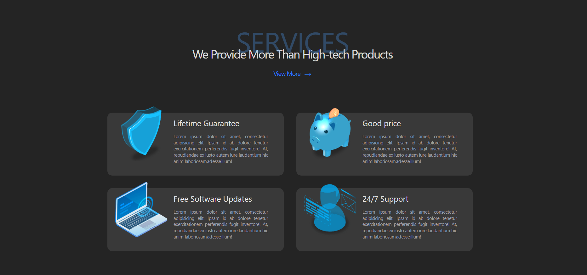

# ⚙️ TechGear

**TechGear** is a modern, responsive tech product showcase website designed to highlight and review gadgets like laptops, phones, mice, keyboards, and more. Whether you're a gamer, developer, or tech enthusiast, TechGear gives you a clean and intuitive interface to explore the latest tech gear.


## 🖼️ Preview




---

## 🌟 Features

- 📱 Responsive design that works across all devices
- 🖱️ Tech gear product pages with images, ratings, and highlights  
- ⚡ Fast performance and SEO-optimized pages
- 🌙 Optional dark mode support

---

## 🛠️ Built With

- [React](https://reactjs.org/) – JavaScript UI library
- [Vite](https://vitejs.dev/) – Build tool for blazing fast dev server and optimized builds
- [Tailwind CSS](https://tailwindcss.com/) – Utility-first CSS framework
- [React Router](https://reactrouter.com/) – For navigation and routing

---

## 🚀 Getting Started

### Prerequisites

Make sure you have **Node.js** and **npm** installed. Then clone the project:

```bash
git clone https://github.com/yourusername/techgear.git
cd techgear
npm install
```  

# React + Vite

This template provides a minimal setup to get React working in Vite with HMR and some ESLint rules.

Currently, two official plugins are available:

- [@vitejs/plugin-react](https://github.com/vitejs/vite-plugin-react/blob/main/packages/plugin-react) uses [Babel](https://babeljs.io/) for Fast Refresh
- [@vitejs/plugin-react-swc](https://github.com/vitejs/vite-plugin-react/blob/main/packages/plugin-react-swc) uses [SWC](https://swc.rs/) for Fast Refresh

## Expanding the ESLint configuration

If you are developing a production application, we recommend using TypeScript with type-aware lint rules enabled. Check out the [TS template](https://github.com/vitejs/vite/tree/main/packages/create-vite/template-react-ts) for information on how to integrate TypeScript and [`typescript-eslint`](https://typescript-eslint.io) in your project.
